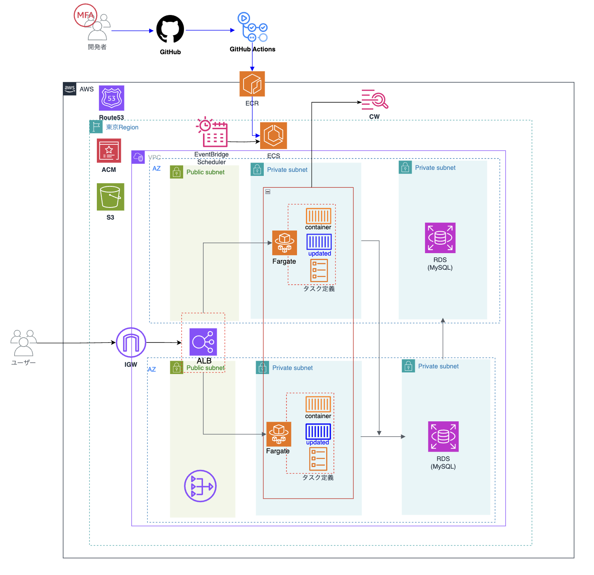

# Tech Hub
**RareTECH受講生が投稿したQiita, Zenn等の記事を収集する記事プラットフォーム**

## DEMO


# 🧑🏼‍💻 Member
### Frontend
- [**kantarou-1209**](https://github.com/kantarou-1209)

### Backend
- [**めがねママ** (Leader)](https://github.com/megane575)
- [**Taroimo-46**](https://github.com/Taroimo-46)

### Infra
- [**Fuji**](https://github.com/anton-fuji)

# 🌱 Skill Stack
| Frontend                                                                                                                                                   | Backend                                                                                                                                                         | Infra                                                                                                                                                               |
|------------------------------------------------------------------------------------------------------------------------------------------------------------|-----------------------------------------------------------------------------------------------------------------------------------------------------------------|---------------------------------------------------------------------------------------------------------------------------------------------------------------------|
|  <br/>  <br/>  |  <br/>  <br/>  |  <br/>  <br/>  <br/>  |

# ⚙️ インフラ構成図


# 🛠️ Setup 
1. **環境変数ファイルの準備**

   - `.env` ファイルをルートディレクトリに作成し、以下の情報を記載してください
     ```.env
     MYSQL_ROOT_PASSWORD=root
     MYSQL_DATABASE=techhub_db
     MYSQL_USER=testuser
     MYSQL_PASSWORD=testuser
     TZ=Asia/Tokyo
     DEBUG=True
     ```

2. **Docker イメージのビルド**

   - 初めて実行する場合、以下のコマンドで Docker イメージをビルドします
     ```bash
     docker compose up --build
     ```

3. **コンテナの起動**

   - アプリケーションを起動するには、以下を実行してください
     **【本番環境】**
     ```bash
     docker compose up
     ```
   - バックグラウンドで実行したい場合
     ```bash
     docker compose up -d
     ```
     **【開発環境】**
     ```bash
     docker compose -f compose.dev.yaml up --build
     ```

4. **ブラウザでアクセス**
   - 以下の URL にアクセスして、アプリケーションを確認します
     - `http://localhost:8080/techhub/` (Nginx 経由)
     - Hello E-tema!と表示されます

### 停止方法

1. **コンテナの停止**
   - 起動中のコンテナを停止するには以下を実行
     ```bash
     docker compose down
     ```
     **【開発環境】**
   ```bash
   docker compose -f compose.dev.yaml down
   ```

### デバッグ方法

1. **ログの確認**

   - コンテナのログを確認するには以下を実行

     ```bash
     docker logs <container_name>
     ```

     例:

     ```bash
     docker logs django
     docker logs nginx
     docker logs mysql
     ```

   - ネットワークの状態確認

   ```
   docker network inspect dev_network
   ```

### ブランチ命名規則

1\. ローカルでブランチを作成。ブランチ名は「`自分の名前#issue番号`」　例）fuji#1
<br>
2\. コードを編集
<br>
3\. コミットする。コミットメッセージには「`#issue番号`」をつける

```
例）git commit -m ‘#1ログイン機能追加’
```

<br>
4. リモートへgit pushする
<br>
5. プルリクする。レビュワーは特に指定せず、見れる人が見てdevelopにマージする。（レビュワーが勝手に設定されて外せないことがあるようで、その場合はそのままプルリクする。レビュワーじゃない人でもマージは可能。）

## 環境構築\_開発（コンテナ起動後）

1. .env ファイルがあることを確認（.env ファイル中身については当ファイルの上部を参照）

2. 以下のコマンドでコンテナ内で migrate する

   ```
   docker exec -it django-dev python3 manage.py migrate
   ```

   <br>これにより MySQL コンテナ内に DB が migrations ファイルにより作成される。</br>

3. static ファイルをまとめて staticfiles ディレクトリに集める　 → これをすると管理画面に CSS があたる
   staticfiles ディレクトリに 140 くらいのファイルが作成される。admin 関係のファイルもあるから、びっくりしない。

   ```
   docker exec -it django-dev python3 manage.py collectstatic
   ```

4. 本当に DB できてるか確認するなら以下のコマンドで MySQL コンテナに入る

   ```
   docker exec -it mysql bash
   mysql -u testuser -p
   ```

   パスワードは.env 参照<br>mysql から出る時は exit</br>

5. Django 管理画面が使用できるように superuser 設定
   ```
   docker exec -it django-dev python3 manage.py createsuperuser
   ```
6. Feed 情報 Django 管理画面で以下を設定

   Qiita http://qiita.com/{account_name}/feed.atom
   <br>Zenn https://zenn.dev/{account_name}/feed</br>

7. Djnago 管理画面　：localhost:8001/admin/
   <br>techhub サイト 　：localhost:8001/techhub/</br>
   accounts 関係　　：localhost:8001/accounts/

8. 記事取得コマンドはカスタムコマンドで設定

   ```
   docker exec -it django-dev python3 manage.py fetch_articles
   ```
